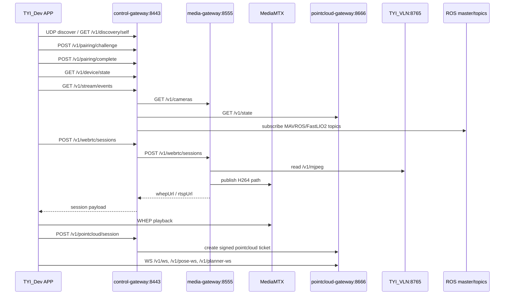
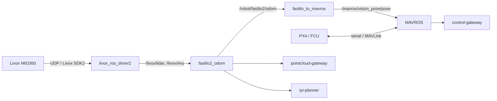
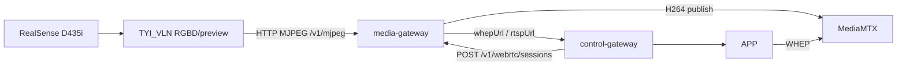
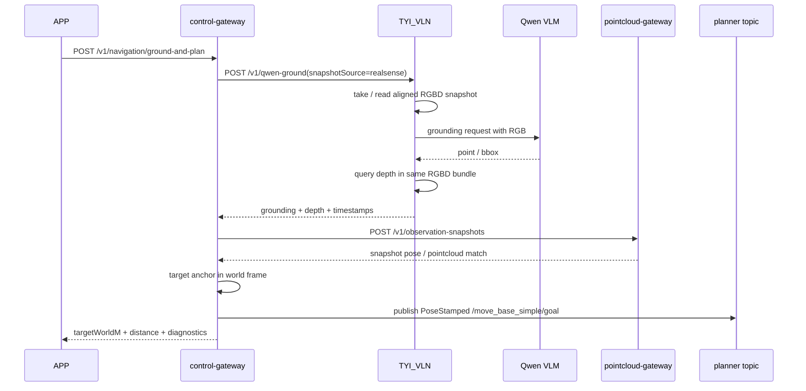
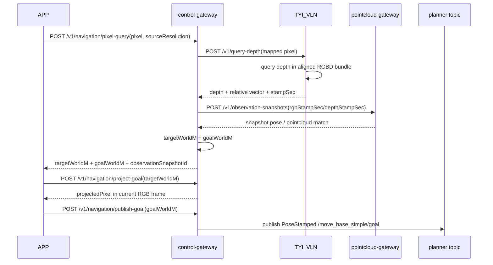

# TYI E100 固件

本文基于当前 `uav-nx` 现场代码与配置梳理系统架构、核心数据链路、模块职责、配置来源和常见注意事项。当前项目根目录为 `/home/uav-nx/uav_workspace/firmware/TYI_E100_Firmware`。

## 1. 项目简介

`TYI E100 固件` 是面向 TYI E100 无人机的 ROS1 Noetic + Docker 固件工程。当前代码同时覆盖飞行定位主链、APP 接入网关、视频转码与 WebRTC、点云地图流、RealSense RGBD/VLM 语言导航，以及可选 planner 服务。

当前运行面由多个容器组成：

- `flight-core`：启动 ROS master、Livox MID360、FastLIO2、fastlio_to_mavros 和 MAVROS/PX4。
- `control-gateway`：面向 APP 的统一 HTTP/SSE/UDP discovery 接入层，聚合飞行、视频、点云和语言导航能力。
- `media-gateway`：消费 `TYI_VLN` 的 MJPEG 源，交给 MediaMTX 输出 WHEP/RTSP。
- `pointcloud-gateway`：订阅 ROS 点云、里程计和 planner 状态，输出点云 WebSocket、pose WebSocket 和 observation snapshot。
- `TYI_VLN` / `realsense-dev`：RealSense D435i 的单一相机 owner，维护 MJPEG 预览和 aligned RGBD snapshot cache，提供 VLM grounding 和 depth query。
- `tyi-planner`：可选 planner overlay 服务，订阅里程计/Livox 点云并发布规划路径与状态。

需要确认：

- `TYI_VLN` 通过 `docker-compose.realsense.yml` 管理，不在默认 `docker-compose.yml` 中；当前现场已运行。
- `planner` 来自 `docker-compose.build.yml` 的 `planner` profile；当前现场已运行。
- `control-gateway` 内仍保留 LiDAR projection fallback 代码，但当前配置关闭，不作为动态目标 depth 主路径。

## 2. 系统架构

### 2.1 容器与服务架构

```mermaid
flowchart LR
  subgraph Hardware[硬件与外部输入]
    MID360[Livox MID360]
    PX4[PX4 / FCU]
    D435i[RealSense D435i]
    APP[iPad / TYI_Dev APP]
    Qwen[DashScope Qwen VLM]
  end

  subgraph Flight[flight-core]
    ROS[roscore]
    Livox[livox_ros_driver2]
    FastLIO2[FastLIO2 odom]
    Bridge[fastlio_to_mavros]
    MAVROS[MAVROS]
  end

  subgraph Vision[TYI_VLN / realsense-dev]
    RGBD[aligned RGBD cache]
    MJPEG[/v1/mjpeg]
    VLM[/v1/qwen-ground]
    Depth[/v1/query-depth]
  end

  subgraph Gateway[APP 接入层]
    Control[control-gateway]
    Media[media-gateway + MediaMTX]
    PointCloud[pointcloud-gateway]
  end

  subgraph Planner[tyi-planner]
    Plan[tyi_ego_planner]
  end

  MID360 --> Livox --> FastLIO2 --> Bridge --> MAVROS --> PX4
  PX4 --> MAVROS
  D435i --> RGBD
  RGBD --> MJPEG
  RGBD --> VLM
  RGBD --> Depth
  Qwen <--> VLM
  MJPEG --> Media
  FastLIO2 --> PointCloud
  FastLIO2 --> Control
  MAVROS --> Control
  PointCloud <--> Control
  VLM <--> Control
  Depth <--> Control
  FastLIO2 --> Plan
  Livox --> Plan
  Plan --> PointCloud
  Control --> Plan
  APP <--> Control
  APP --> Media
  APP --> PointCloud
```

### 2.2 模块分层

| 层级 | 模块 | 主要文件 | 职责 |
| --- | --- | --- | --- |
| 硬件采集 | Livox MID360 | `configs/livox/MID360_config.json`、`workspace/src/uav_base_bringup/launch/base_stack.launch` | 输出 `/livox/lidar`、`/livox/imu` |
| 飞行定位 | FastLIO2 | `configs/fastlio2/mid360.yaml`、`workspace/src/fast_lio/*` | 从 Livox 点云/IMU 估计里程计和关键帧点云 |
| 飞控桥接 | fastlio_to_mavros、MAVROS | `configs/fastlio_to_mavros/bridge.yaml`、`configs/mavros/*.yaml` | 将视觉/雷达里程计桥接到 MAVROS/PX4 |
| RGBD/VLM | TYI_VLN | `docker/realsense-dev/*`、`configs/realsense/d435i_ros.yaml` | RealSense 单 owner、RGBD 快照、VLM grounding、depth query、MJPEG |
| APP 控制面 | control-gateway | `docker/control-gateway/app.py`、`configs/control-gateway/config.json` | 配对、token、状态聚合、SSE、WHEP 会话代理、语言导航 |
| 视频面 | media-gateway | `docker/media-gateway/app.py`、`configs/media-gateway/config.json` | MJPEG 输入、MediaMTX、WHEP/RTSP 会话 |
| 点云面 | pointcloud-gateway | `docker/pointcloud-gateway/app.py`、`configs/pointcloud-gateway/config.json` | 点云地图、pose/planner WS、observation snapshot |
| 规划 | tyi-planner | `docker/planner/*`、`planner_workspace/*` | 局部规划、轨迹与状态发布 |
| 部署运维 | scripts / compose | `docker-compose*.yml`、`scripts/*.sh`、`.env`、`machine.env` | 构建、部署、健康检查、机器配置 |

### 2.3 服务调用关系



## 3. 核心数据链路

### 3.1 飞行定位链路

输入来源：

- Livox MID360 点云与 IMU。
- PX4 / FCU 串口。
- 机型与网络参数来自 `machine.env` 和 `.env`。

处理流程：

1. `flight-core` 入口 `docker/runtime/entrypoint.sh` 创建共享 timebase 文件并等待 Livox 网卡就绪。
2. 入口脚本启动 `roscore`。
3. `base_stack.launch` 启动 `livox_ros_driver2`，发布 `/livox/lidar` 和 `/livox/imu`。
4. `fastlio2_odom` 订阅 Livox 数据，输出 `/robot/fastlio2/odom`、关键帧点云和路径。
5. `fastlio_to_mavros` 读取 `/robot/fastlio2/odom`，向 MAVROS vision pose 链路桥接。
6. MAVROS 通过 `FCU_URL` 接入 PX4，并发布状态、电池、本地位置、全局位置等 topic。

输出与消费：

- `control-gateway` 订阅 MAVROS 和 FastLIO2 topic，形成飞行状态与 offboard readiness。
- `pointcloud-gateway` 订阅 FastLIO2 里程计和点云，生成点云地图流。
- `tyi-planner` 订阅里程计和 Livox 点云，用于规划。



### 3.2 实时视频链路

输入来源：

- RealSense D435i。
- `TYI_VLN` 的 `/v1/mjpeg`。

处理流程：

1. `TYI_VLN` 作为 D435i 单一 owner，维护 RGBD stream 与 preview bundle。
2. `TYI_VLN` 输出 MJPEG：`http://127.0.0.1:8765/v1/mjpeg`。
3. `media-gateway` 以 `sourceMode=mjpeg` 消费该 MJPEG 源。
4. `media-gateway` 使用 MediaMTX 生成 `camera-480p15` path，并输出 WHEP/RTSP。
5. APP 通过 `control-gateway` 创建 WebRTC session，但实际播放使用返回的 WHEP URL。

当前现场状态：

- `media-gateway /v1/cameras` 上报 `availableProfiles=["480p15"]`。
- `selectedProfile` 为 `640x480 @ 15fps`。
- 旧的直接打开 `/dev/video*` 路径仍在配置中保留为字段，但当前主链路应以 `TYI_VLN /v1/mjpeg` 为准。



### 3.3 点云地图与姿态链路

输入来源：

- `/robot/fastlio2/pointcloud/keyframe`
- `/robot/fastlio2/odom`
- `/robot/fastlio2/pointcloud/deskewed`，当前 `enableLiveLayer=false`
- `/tyi_planner/predicted_path`
- `/tyi_planner/status`

处理流程：

1. `pointcloud-gateway` 的 `RosCollector` 订阅 FastLIO2 和 planner topic。
2. `PointCloudStore` 将关键帧点云体素化、分 tile 缓存，输出 snapshot + delta tiles。
3. pose、planner path/status 以独立 WebSocket 推送。
4. `control-gateway` 为 APP 生成签名 ticket，APP 用 ticket 连接 `pointcloud-gateway`。

输出与消费：

- `GET /v1/state`：点云网关状态。
- `GET /v1/capabilities`：能力与 profiles。
- `GET /v1/ws?ticket=...`：地图 tile 二进制流。
- `GET /v1/pose-ws?ticket=...`：pose JSON stream。
- `GET /v1/planner-ws?ticket=...`：planner path/status stream。
- `POST /v1/observation-snapshots`：按 RGB/depth/pose/pointcloud 时间约束创建 observation snapshot。

```mermaid
flowchart LR
  FastLIO2[FastLIO2] -->|keyframe pointcloud| Store[PointCloudStore]
  FastLIO2 -->|odom| Store
  Planner[tyi-planner] -->|predicted_path/status| Store
  Store -->|snapshot + delta tiles| WS[/v1/ws]
  Store -->|pose| PoseWS[/v1/pose-ws]
  Store -->|planner| PlannerWS[/v1/planner-ws]
  CG[control-gateway] -->|signed ticket| APP[APP]
  APP --> WS
  APP --> PoseWS
  APP --> PlannerWS
```

### 3.4 语言/点选导航与动态目标链路

输入来源：

- APP 传入自然语言指令。
- APP 在实时视频上点选目标像素和源视频分辨率。
- `TYI_VLN` 提供同一时刻的 RGB、depth、相机信息和 RGBD bundle 时间戳。
- `pointcloud-gateway` 提供 observation snapshot，将 RGB/depth 时间戳与 pose/pointcloud 历史对齐。
- Qwen VLM 提供 grounding 结果。

语言导航处理流程：

1. APP 调用 `POST /v1/navigation/ground-query` 或 `POST /v1/navigation/ground-and-plan`。
2. `control-gateway` 规范化 `snapshotSource`，当前默认使用 `realsense`。
3. `control-gateway` 调用 `TYI_VLN /v1/qwen-ground`，VLM 在提交 RGB 上返回目标点或 bbox。
4. `TYI_VLN` 在同一 RGBD snapshot 上执行 depth query，返回 `relativeToBaseLinkM`、距离、采样诊断和时间戳。
5. `control-gateway` 调用 `pointcloud-gateway /v1/observation-snapshots`，按 `maxRgbDepthDtSec`、`maxPoseDtSec`、`maxPointcloudDtSec` 校验时间一致性。
6. `control-gateway` 使用 snapshot pose 将目标从相机/机体系转换为世界系三维锚点。
7. 若是 `ground-and-plan`，`control-gateway` 发布 `PoseStamped` 到 `plannerGoalTopic`，当前默认 `/move_base_simple/goal`。
8. APP 显示时应优先使用服务端返回的三维目标锚点和实时重投影结果，而不是固定送检帧二维像素。

点选导航处理流程：

1. APP 调用 `POST /v1/navigation/pixel-query`，提交 `pixel` 和 `sourceResolution`。
2. `control-gateway` 将点击像素映射到 RealSense depth query 分辨率。
3. `control-gateway` 调用 `TYI_VLN /v1/query-depth`，从 RealSense aligned RGBD bundle 读取点击时刻的深度和时间戳。
4. `control-gateway` 调用 `pointcloud-gateway /v1/observation-snapshots`，用 RGBD 时间戳恢复当时 pose 和点云上下文。
5. `control-gateway` 使用 snapshot pose 生成 `targetWorldM`，并按 standoff 生成 `goalWorldM`。
6. APP 红点显示调用 `POST /v1/navigation/project-goal`，围绕 `targetWorldM` 做实时反投影。
7. APP 确认飞行时调用 `POST /v1/navigation/publish-goal` 发布预览阶段已经冻结的 `goalWorldM`，不应再次用旧点击像素调用 `/pixel-and-plan` 二次测距。

关键约束：

- VLM 送检 RGB、depth query、用于三维锚定的 pose 必须来自同一 snapshot 恢复链路。
- 点选导航点击像素、depth query、用于三维锚定的 pose 也必须来自同一 snapshot 恢复链路。
- 预览后确认飞行必须发布预览阶段冻结的 `goalWorldM`，否则无人机晃动后同一屏幕像素可能已对应不同空间点。
- 当前 `instructionDepthFallback.enabled=false`，不使用 LiDAR 作为目标 depth fallback。
- 当前 `lidarPixelProjection.enabled=false`，保留代码但非主路径。





### 3.5 APP 接入链路

输入来源：

- APP 局域网 discovery、用户配对输入、导航输入、会话请求。

处理流程：

1. APP 通过 UDP `19001` 或 `GET /v1/discovery/self` 发现设备。
2. APP 调用 `POST /v1/pairing/challenge`，获取 nonce 和支持的 proof 类型。
3. APP 调用 `POST /v1/pairing/complete`，完成 shared code 或 HMAC 配对。
4. APP 保存 access token 和 refresh token。
5. APP 调用 `GET /v1/device/state` 获取状态快照。
6. APP 建立 `GET /v1/stream/events` SSE，消费 `snapshot`、`state`、`health`、`alarm`、`log`。
7. APP 通过 `POST /v1/webrtc/sessions` 获取视频会话。
8. APP 通过 `POST /v1/pointcloud/session` 获取点云 ticket。

## 4. 模块说明

### 4.1 `flight-core`

功能说明：

- 管理 ROS master 和基础飞行定位链路。
- 启动 Livox、FastLIO2、fastlio_to_mavros、MAVROS。
- 负责 PX4/MAVLink 接入和定位数据进入 MAVROS。

输入：

- Livox MID360 UDP 数据。
- PX4 串口 `/dev/ttyTHS0:115200`，可由 `FCU_URL` 覆盖。
- `machine.env` 和 `.env`。

输出：

- `/livox/lidar`、`/livox/imu`
- `/robot/fastlio2/odom`
- `/robot/fastlio2/pointcloud/keyframe`
- `/mavros/*`

关键文件：

- `docker/runtime/entrypoint.sh`
- `workspace/src/uav_base_bringup/launch/base_stack.launch`
- `configs/livox/MID360_config.json`
- `configs/fastlio2/mid360.yaml`
- `configs/fastlio2/mid360.yaml`
- `configs/fastlio_to_mavros/bridge.yaml`
- `configs/mavros/px4_config.yaml`

### 4.2 `control-gateway`

功能说明：

- APP 统一入口：discovery、pairing、token、状态、健康、日志、SSE。
- 代理创建 WebRTC 和点云 session。
- 订阅 ROS 飞行状态，计算 offboard readiness。
- 调用 `TYI_VLN` 完成 VLM grounding/depth query。
- 调用 `pointcloud-gateway` 创建 observation snapshot。
- 向 planner goal topic 发布导航目标。

输入：

- APP HTTP/SSE 请求。
- ROS topic：`/mavros/state`、`/mavros/extended_state`、`/mavros/battery`、`/mavros/local_position/odom`、`/mavros/global_position/global`、`/mavros/vision_pose/pose`、`/robot/fastlio2/odom` 等。
- `media-gateway /v1/cameras`。
- `pointcloud-gateway /v1/state`。
- `TYI_VLN /v1/qwen-ground`、`/v1/query-depth`。

输出：

- HTTP API：`/healthz`、`/v1/device/state`、`/v1/stream/events`、`/v1/navigation/*` 等。
- UDP discovery：`19001`。
- Planner goal：默认 `/move_base_simple/goal`。

关键内部类：

- `StateStore`：状态、配对、token、告警、健康快照。
- `EventBroker`：SSE 事件分发。
- `RosCollector`：ROS topic 采集。
- `NavigationController`：pixel query、ground query、目标解算和发布 goal。
- `MediaClient` / `PointCloudClient` / `VlmClient`：下游 HTTP 客户端。

### 4.3 `media-gateway`

功能说明：

- 探测并消费相机输入。
- 当前主路径为 `sourceMode=mjpeg`，读取 `TYI_VLN /v1/mjpeg`。
- 控制 MediaMTX，发布 WHEP/RTSP session。
- 提供 camera 状态和会话 API。

输入：

- MJPEG URL：`http://127.0.0.1:8765/v1/mjpeg`。
- `configs/media-gateway/config.json`。
- APP 或 `control-gateway` 的 session 请求。

输出：

- `GET /v1/cameras`
- `POST /v1/webrtc/sessions`
- `GET /v1/webrtc/sessions`
- MediaMTX path：当前 `camera-480p15`

### 4.4 `pointcloud-gateway`

功能说明：

- 采集 FastLIO2 keyframe 点云和 odom。
- 生成点云地图 tile、pose stream 和 planner stream。
- 维护 observation snapshot 历史，用于动态识别场景恢复。
- 使用 signed ticket 控制 WebSocket 接入。

输入：

- ROS：keyframe pointcloud、odom、planner path/status、可选 live pointcloud。
- `control-gateway` 的 pointcloud session 和 observation snapshot 请求。

输出：

- `GET /v1/state`
- `GET /v1/capabilities`
- `GET /v1/ws`
- `GET /v1/pose-ws`
- `GET /v1/planner-ws`
- `POST /v1/observation-snapshots`

### 4.5 `TYI_VLN` / `realsense-dev`

功能说明：

- 作为 RealSense D435i 的单一 owner。
- 维护 RGBD aligned bundle cache 和 MJPEG preview。
- 提供 depth query、snapshot、Qwen VLM grounding。
- 可选 ROS bridge 当前配置为 disabled。

输入：

- D435i RGB/depth。
- Qwen/DashScope API。
- `configs/realsense/d435i_ros.yaml`。
- `docker-compose.realsense.yml` 中的 RealSense/VLM 环境变量。

输出：

- `GET /healthz`
- `GET /v1/mjpeg`
- `GET/POST /v1/query-depth`
- `GET/POST /v1/snapshot`
- `GET /v1/realsense-snapshot`
- `POST /v1/qwen-ground`

### 4.6 `tyi-planner`

功能说明：

- 使用 `tyi_ego_planner.launch` 启动 planner。
- 订阅 odom 和 Livox 点云。
- 发布规划轨迹、状态和 shadow setpoint topic。

输入：

- `/robot/fastlio2/odom`
- `/livox/lidar`
- `TYI_PLANNER_*` 环境变量。

输出：

- `/tyi_planner/predicted_path`
- `/tyi_planner/status`
- `/tyi_planner/mavros/setpoint_raw/local_shadow`

需要确认：

- `control-gateway` 发布目标到 `/move_base_simple/goal`，planner 是否稳定订阅该 topic 取决于当前 planner launch 的实际实现。

## 5. 配置说明（含示例）

### 5.1 配置来源

| 来源 | 文件 | 作用 |
| --- | --- | --- |
| 环境变量 | `.env` | 容器名、镜像、端口、设备身份、gateway、RealSense、planner 参数 |
| 机型环境变量 | `machine.env` | FCU 串口、Livox SN/IP、宿主机网卡与端口 |
| Compose | `docker-compose.yml` | 默认服务：flight-core、control-gateway、pointcloud-gateway、media-gateway |
| Compose overlay | `docker-compose.build.yml` | build 定义与 planner profile |
| Compose overlay | `docker-compose.realsense.yml` | `TYI_VLN` / RealSense/VLM 服务 |
| JSON/YAML | `configs/*` | 容器运行配置、ROS 参数、gateway 参数 |
| 代码默认值 | `docker/*/*.py`、`docker/*/*.sh` | 缺省端口、topic、URL、超时、profile |

### 5.2 `.env` 主要配置组

示例只展示变量名和含义，不包含敏感值。

```dotenv
# 设备身份
DEVICE_ID=...
DISPLAY_NAME=...
FIRMWARE_VERSION=...

# 控制面
CONTROL_GATEWAY_HTTP_PORT=8443
CONTROL_GATEWAY_DISCOVERY_PORT=19001
CONTROL_GATEWAY_PAIRING_MODE=development
CONTROL_GATEWAY_NONCE_TTL_SEC=180
CONTROL_GATEWAY_ACCESS_TOKEN_TTL_SEC=43200
CONTROL_GATEWAY_REFRESH_TOKEN_TTL_SEC=2592000
CONTROL_GATEWAY_MAX_PAIRED_CLIENTS=64
CONTROL_GATEWAY_STALE_CLIENT_TTL_SEC=604800

# 媒体面
MEDIA_GATEWAY_HTTP_PORT=8555
MEDIA_GATEWAY_SNAPSHOT_URL=rtsp://127.0.0.1:8554/camera-480p15

# 点云面
POINTCLOUD_GATEWAY_HTTP_PORT=8666
POINTCLOUD_GATEWAY_DEFAULT_PROFILE=balanced

# RealSense / VLM
REALSENSE_RGBD_SNAPSHOT_ENABLE=true
REALSENSE_RGBD_STREAM_ENABLE=true
REALSENSE_RGBD_ALIGN_FPS=4
REALSENSE_MJPEG_MAX_FPS=15
REALSENSE_SNAPSHOT_CACHE_MAX_AGE_SEC=0.35
QWEN_VLM_MODEL=...

# Planner
TYI_PLANNER_ODOM_TOPIC=/robot/fastlio2/odom
TYI_PLANNER_LIVOX_TOPIC=/livox/lidar
TYI_PLANNER_MAX_VEL=0.8
```

### 5.3 `machine.env` 主要配置组

```dotenv
FCU_DEVICE=/dev/ttyTHS0
FCU_BAUD=115200
FCU_URL=/dev/ttyTHS0:115200
HOST_ETH_IFACE=eth0
HOST_ETH_IP=192.168.1.5
MID360_BD_LIST=...
MID360_SN_SUFFIX=...
LIVOX_BD_LIST=...
```

### 5.4 关键配置文件

| 文件 | 关键字段 |
| --- | --- |
| `configs/control-gateway/config.json` | `device`、`network`、`pointcloud`、`navigation`、`pairing`、`health`、`eventStream`、`offboardReadyTuning` |
| `configs/media-gateway/config.json` | `camera.sourceMode`、`camera.sourceUrl`、`camera.preferredProfiles`、`mediamtx.*` |
| `configs/pointcloud-gateway/config.json` | `observations.*`、`sources.*`、`streaming.*`、`profiles`、`health` |
| `configs/realsense/d435i_ros.yaml` | RealSense intrinsics、RGB/depth 外参、depth scale、projection、ROS bridge enable |
| `configs/fastlio_to_mavros/bridge.yaml` | `fastlio_topic`、`vision_topic`、`stamp_source` |
| `configs/mavros/px4_config.yaml` | MAVROS plugin 参数、frame、timesync、fake_gps 等 |
| `configs/fastlio2/mid360.yaml` | FastLIO2 frame、IMU、GICP、keyframe、voxel 参数 |

### 5.5 硬编码、重复、未使用与调试遗留项

以下是基于当前代码扫描的配置性问题标记，不代表必须立即修改：

| 类型 | 位置 | 说明 |
| --- | --- | --- |
| 硬编码默认值 | `docker/control-gateway/app.py` | 多处默认 URL、端口、topic 和模型名通过代码兜底，如 `127.0.0.1:8765`、`/move_base_simple/goal`、`qwen3-vl-plus` |
| 重复配置 | `.env`、`configs/control-gateway/config.json`、`docker-compose.yml` | control-gateway 端口、device identity、pointcloud secret、profile 同时存在于 env、config 和 compose 默认值 |
| 重复配置 | `configs/realsense/d435i_ros.yaml` 与 `configs/control-gateway/config.json` | 相机内参和 `baseToCameraLink` 在 RealSense 和 control-gateway navigation 配置中各存一份 |
| 重复配置 | `docker-compose.realsense.yml` 与 `.env` | RealSense 默认值在 compose overlay 和 `.env` 中同时存在 |
| 调试遗留 | `docker/pointcloud-gateway/app.py` | 启动时生成并打印 `debug ticket for local verification`，用于本地验证 |
| 调试工具 | `docker/realsense-dev/vlm_board_locator.py`、`vlm_board_stability.py` | 保留 VLM 标定/稳定性调试脚本和 `--debug-image` 参数 |
| 测试/示例字段 | `configs/livox/msg_MID360.launch` | `lvx_file_path` 默认 `livox_test.lvx` |
| TODO 注释 | `configs/mavros/px4_config.yaml` | `field_of_view: 0.0 # XXX TODO` 等 MAVROS 示例参数 |
| 旧 wrapper | `scripts/enter.sh`、`scripts/logs.sh` | skill 记录显示仍可能引用旧 `base-stack` 命名，实际主容器为 `flight-core` |
| 需要确认 | `configs/control-gateway/config.json` | `instructionDepthFallback.enabled=false` 但 fallback 参数仍保留，属于关闭状态的历史/备用配置 |
| 需要确认 | `configs/control-gateway/config.json` | `lidarPixelProjection.enabled=false`，代码仍保留 LiDAR projection 逻辑 |
| 需要确认 | `control-gateway` 与 planner | `plannerGoalTopic=/move_base_simple/goal` 与 planner 实际订阅关系需以 planner launch/topic 验证 |

## 6. 运行流程

### 6.1 默认启动

```bash
cd /home/uav-nx/uav_workspace/firmware/TYI_E100_Firmware
docker compose up -d
```

默认启动：

- `flight-core`
- `control-gateway`
- `pointcloud-gateway`
- `media-gateway`

### 6.2 本地构建 overlay

```bash
docker compose -f docker-compose.yml -f docker-compose.build.yml up -d --build
```

`docker-compose.build.yml` 为默认服务提供 build 定义，并提供 `planner` profile。

### 6.3 RealSense / VLM 服务

```bash
docker compose -f docker-compose.yml -f docker-compose.build.yml -f docker-compose.realsense.yml --profile realsense-dev up -d realsense-dev
```

当前现场 `TYI_VLN` 已运行并健康。RealSense 相关链路调试时，应先查看：

```bash
curl -fsS http://127.0.0.1:8765/healthz
curl -fsS http://127.0.0.1:8765/v1/snapshot
```

### 6.4 验证命令

```bash
docker compose ps
curl -fsS http://127.0.0.1:8443/healthz
curl -fsS http://127.0.0.1:8555/v1/cameras
curl -fsS http://127.0.0.1:8666/v1/state
curl -fsS http://127.0.0.1:8765/healthz
```

### 6.5 APP 推荐接入流程

1. UDP `19001` discovery 或 `GET /v1/discovery/self`。
2. `POST /v1/pairing/challenge`。
3. `POST /v1/pairing/complete`。
4. `GET /v1/device/state`。
5. `GET /v1/stream/events`。
6. `POST /v1/webrtc/sessions`。
7. `POST /v1/pointcloud/session`。
8. 语言导航使用 `POST /v1/navigation/ground-query` 或 `POST /v1/navigation/ground-and-plan`。
9. 点选导航预览使用 `POST /v1/navigation/pixel-query`，确认飞行使用 `POST /v1/navigation/publish-goal` 发布预览阶段冻结的 `goalWorldM`。

## 7. 常见问题与注意事项

### 7.1 动态识别红点不能固定旧像素

动态飞行或机体晃动时，APP 不应把 VLM grounding 返回的送检帧二维像素，或点选导航提交的旧点击像素，固定画到实时视频。正确链路是：

1. 服务端用同一 RGBD snapshot 完成 grounding 和 depth。
2. 服务端创建 observation snapshot，恢复当时 pose。
3. 服务端解算目标世界系三维锚点。
4. APP 使用三维锚点和当前姿态重投影显示红点。

点选导航还需要避免另一个一致性错误：预览已经拿到 `targetWorldM` / `goalWorldM` 后，确认飞行不能再次按原始点击像素测距。确认飞行应直接发布预览阶段冻结的 `goalWorldM`，红点继续围绕 `targetWorldM` 实时反投影。

### 7.2 当前视频 profile 不是 1080p30

当前现场 `media-gateway` 上报 `480p15`。APP 创建 WHEP session 时必须先读取 `availableProfiles` 或使用服务端返回的 session URL，不要硬编码旧 profile。

### 7.3 不要让多个进程同时打开 RealSense

当前 D435i 的 owner 是 `TYI_VLN`。`media-gateway` 应消费 `TYI_VLN /v1/mjpeg`，不要再直接打开 `/dev/video*`，否则可能导致视频黑屏、snapshot 不可用或相机锁竞争。

### 7.4 `no valid depth samples`

该错误通常表示 VLM 命中的像素区域在当前 RGBD snapshot 中没有可靠深度。排查顺序：

1. `TYI_VLN /healthz` 的 `cachedRgbdBundle.available` 和 age。
2. `REALSENSE_SNAPSHOT_CACHE_MAX_AGE_SEC` 是否过小。
3. VLM grounding 的点或 bbox 是否落在无深度/透明/反光/边缘区域。
4. `depthDiagnostics` 中的 sample count、rejection reasons 和 spread。

### 7.5 `planner subscriber not ready`

`control-gateway` 发布 planner 目标前会等待 `plannerGoalTopic` 有订阅者。若出现该错误：

1. 确认 `tyi-planner` 是否运行。
2. 确认 planner 是否订阅 `/move_base_simple/goal`。
3. 确认 `TYI_PLANNER_GOAL_TOPIC` 或 `configs/control-gateway/config.json` 中的 `plannerGoalTopic` 是否与 planner 实际订阅一致。

### 7.6 点云 WebSocket 必须带 ticket

`pointcloud-gateway` 的 `/v1/ws`、`/v1/pose-ws`、`/v1/planner-ws` 需要 signed ticket。APP 应通过 `control-gateway /v1/pointcloud/session` 获取 ticket，而不是自行构造。

### 7.7 敏感信息处理

配对共享码、token、点云共享密钥、DashScope API key 不应写入日志、文档示例或聊天输出。文档中只保留变量名和用途。

## 8. 后续优化建议

以下建议仅用于改善文档一致性、可维护性和调试效率，不涉及量产评估：

- 将相机内参与 `baseToCameraLink` 收敛为单一配置来源，避免 RealSense 与 control-gateway 配置漂移。
- 将 `/move_base_simple/goal` 与 planner 订阅关系写入 planner 文档或 health detail，减少联调时的 topic 猜测。
- 将 `pointcloud-gateway` 的本地 debug ticket 输出改为显式 debug 开关控制，默认日志只输出 endpoint 和 profile。
- 在文档索引中区分默认 compose、build overlay、RealSense overlay 和 planner profile。
- 为 `control-gateway` 的 `/v1/navigation/*` 增加一页字段解释，尤其是 `targetWorldM`、`observationSnapshotId`、`depthDiagnostics`、`projectedPixel`。
- 梳理旧 wrapper 脚本命名，使 `enter.sh`、`logs.sh` 与当前 `flight-core` 容器名一致。
- 为配置项生成一份机器可读清单，例如 `docs/zh_CN/配置矩阵.md`，列出 env/config/code default 的优先级。
