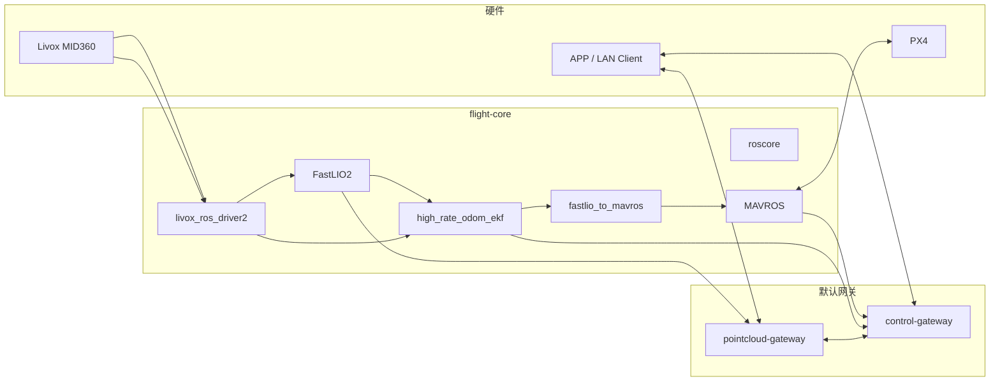

# 系统架构与数据链路

本文基于当前 `uav-nano` 现场代码与配置梳理系统架构、核心数据链路、模块职责、配置来源和验证入口。当前项目根目录为 `/home/uav_nano/TYI_E100_Firmware`。

`TYI E100 固件` 是面向 TYI E100 / Nano 飞行平台的 ROS1 Noetic + Docker 固件工程。默认启动链路聚焦飞行定位、PX4/MAVROS 接入、APP 控制面和点云输出；视频、视觉/VLM 与 planner 保留为可选 profile，默认不作为 Nano 必需依赖。

## 1. 默认运行面

默认 `docker compose up -d` 启动以下服务：

| 服务 | 作用 | 默认状态 |
| --- | --- | --- |
| `flight-core` | ROS master、Livox MID360、FastLIO2、EKF 高频融合、fastlio_to_mavros、MAVROS/PX4 | 启动 |
| `control-gateway` | APP discovery、配对、状态、SSE、健康聚合、点云 session 代理 | 启动 |
| `pointcloud-gateway` | 订阅点云与里程计，输出点云地图、姿态流和 observation snapshot 接口 | 启动 |
| `media-gateway` | 视频转码与 WHEP/RTSP 接入 | `media` profile，可选 |
| `vision-gateway` | 视觉/VLM 能力扩展入口 | `vision` profile，可选 |
| `planner` | 局部规划 overlay | `planner` profile，可选 |



## 2. 飞行定位链路

### 2.1 输入

- Livox MID360 点云与 IMU 数据。
- PX4 通过机载串口接入 MAVROS。
- 机型差异来自 `machine.env`，并由 `scripts/configure_machine.sh` 回写 `.env` 与 Livox 配置。

当前 Nano 验证配置：

```dotenv
FCU_DEVICE=/dev/ttyTHS0
FCU_BAUD=921600
HOST_ETH_IFACE=eth0
HOST_ETH_IP=192.168.1.50
```

### 2.2 处理流程

1. `docker/runtime/entrypoint.sh` 初始化共享 timebase 文件，等待 Livox 网卡就绪，并启动 `roscore`。
2. `base_stack.launch` 启动 `livox_ros_driver2`，采集 MID360 点云与 IMU。
3. FastLIO2 使用 MID360 数据估计雷达里程计、关键帧点云和路径。
4. `high_rate_odom_ekf` 融合 FastLIO2 里程计与 Livox IMU 高频数据，生成更连续的里程计输出。
5. `fastlio_to_mavros` 将融合后的里程计转入 MAVROS vision pose 链路。
6. MAVROS 通过 `FCU_URL` 与 PX4 通信，并向 ROS/网关输出飞控状态、本地位置、电池等数据。

### 2.3 EKF 高频融合优化

本次 Nano 优化点集中在 `high_rate_odom_ekf`：

- 使用 FastLIO2 低频但稳定的位姿作为绝对更新来源。
- 使用 Livox IMU 高频角速度和加速度做短时传播。
- 取消固定输出限频，使融合输出可跟随可用 IMU 节奏。
- 不新增重力校准、落地状态判断等额外行为，避免扩大飞行主链副作用。
- 通过 `fastlio_to_mavros` 向 MAVROS 提供更高频、更连续的 vision pose 输入。

该优化的目的不是替代 FastLIO2，而是降低 FastLIO2 低频输出直接进入 MAVROS 时的离散性，让 PX4 侧获得更平滑的外部视觉位姿流。

关键文件：

| 文件 | 作用 |
| --- | --- |
| `workspace/src/uav_base_bringup/scripts/high_rate_odom_ekf.py` | EKF 高频融合节点 |
| `workspace/src/uav_base_bringup/launch/base_stack.launch` | 默认飞行链路 launch |
| `configs/fastlio2/mid360.yaml` | FastLIO2 参数 |
| `configs/fastlio_to_mavros/bridge.yaml` | MAVROS vision pose 桥接参数 |
| `configs/mavros/px4_config.yaml` | MAVROS/PX4 参数 |

## 3. 网关链路

### 3.1 `control-gateway`

`control-gateway` 是 APP 与默认固件能力的统一入口：

- UDP discovery 与 HTTP discovery。
- 配对、token、设备状态、健康状态、SSE 事件流。
- MAVROS 和定位状态采集。
- 点云 session 代理。
- 可选媒体、视觉、planner 能力的状态聚合与调用入口。

关键接口：

| 接口 | 作用 |
| --- | --- |
| `GET /healthz` | 网关健康状态 |
| `GET /v1/discovery/self` | 设备发现信息 |
| `POST /v1/pairing/challenge` | 配对挑战 |
| `POST /v1/pairing/complete` | 完成配对 |
| `GET /v1/device/state` | 设备状态快照 |
| `GET /v1/stream/events` | SSE 状态流 |
| `POST /v1/pointcloud/session` | 创建点云 WebSocket ticket |

### 3.2 `pointcloud-gateway`

`pointcloud-gateway` 负责将 ROS 点云和姿态数据转换为 APP 可消费的网络接口：

- 订阅 FastLIO2 关键帧点云、实时点云和里程计。
- 对关键帧点云做体素化、分 tile 缓存和增量推送。
- 输出 pose WebSocket，供 APP 显示当前位姿和轨迹。
- 保留 planner path/status 与 observation snapshot 接口，供后续扩展使用。

关键接口：

| 接口 | 作用 |
| --- | --- |
| `GET /healthz` | 点云网关健康状态 |
| `GET /v1/state` | 点云缓存、订阅和配置状态 |
| `GET /v1/capabilities` | 点云 profile 与能力声明 |
| `GET /v1/ws?ticket=...` | 点云 tile 二进制流 |
| `GET /v1/pose-ws?ticket=...` | 位姿 JSON 流 |
| `GET /v1/planner-ws?ticket=...` | planner 状态流，未启用 planner 时为空或降级 |

## 4. 可选扩展边界

### 4.1 `media-gateway`

`media-gateway` 默认不启动。只有接入相机、视频编码和 WHEP/RTSP 需求时才启用：

```bash
docker compose --profile media up -d media-gateway
```

启用后应以 `control-gateway` 返回的能力与 session URL 为准，客户端不应硬编码视频 profile。

### 4.2 `vision-gateway`

`vision-gateway` 默认不启动。它用于后续视觉/VLM 能力扩展，当前 Nano 默认飞行链路不依赖该服务：

```bash
docker compose --profile vision up -d vision-gateway
```

### 4.3 `planner`

`planner` 位于 `docker-compose.build.yml` 的 `planner` profile 中：

```bash
docker compose -f docker-compose.yml -f docker-compose.build.yml --profile planner up -d planner
```

启用 planner 前，应确认其订阅的里程计、Livox 点云和 goal topic 与现场配置一致。

## 5. 配置来源

| 来源 | 文件 | 作用 |
| --- | --- | --- |
| 机型配置 | `machine.env` | FCU 串口、波特率、MID360 SN/IP、宿主机网卡和端口 |
| 运行环境 | `.env` | 镜像名、容器名、端口、设备身份、MAVROS、gateway 与可选扩展参数 |
| Compose | `docker-compose.yml` | 默认服务与可选 media/vision profiles |
| Build overlay | `docker-compose.build.yml` | 本地构建定义与 planner profile |
| ROS/JSON/YAML | `configs/*` | Livox、FastLIO2、MAVROS、gateway 等运行配置 |
| ROS 源码 | `workspace/src/*` | FastLIO/MAVROS 桥接、EKF、bringup 等源码与 launch |
| 运维脚本 | `scripts/*` | 部署、构建、状态、日志、验证入口 |

日常修改建议：

- 机型差异优先改 `machine.env`。
- 不直接手改 `configs/livox/MID360_config.json`，除非明确不走 `configure_machine.sh`。
- 可选能力通过 profile 启用，不要把未接入硬件的服务改成默认依赖。
- 配对码、token、共享密钥和云端 API key 不写入文档示例或日志输出。

## 6. 验证入口

基础状态：

```bash
docker compose ps
curl -fsS http://127.0.0.1:8443/healthz
curl -fsS http://127.0.0.1:8666/healthz
```

ROS/MAVROS 状态可在 `flight-core` 内查看：

```bash
docker exec -it flight-core bash
source /opt/uav/base_stack/workspace/devel_isolated/setup.bash 2>/dev/null || true
rostopic hz /mavros/vision_pose/pose
rostopic echo -n 1 /mavros/state
```

时间基与高频链路验证：

```bash
bash ./scripts/validate_timebase.sh
```

## 7. 常见注意事项

- PX4 与 MAVROS 的串口波特率必须一致；当前 Nano 验证链路使用 `921600`。
- MID360 SN、IP、宿主机网口 IP 必须与实际硬件和网络一致。
- MAVROS `connected: True` 只代表 MAVLink 链路正常，能否解锁还取决于 PX4 传感器、EKF、RC/安全开关、模式和 failsafe 条件。
- `media-gateway` 与 `vision-gateway` 默认关闭是预期行为，不应作为默认健康检查失败项。
- 点云 WebSocket 需要通过 `control-gateway` 创建 signed ticket，APP 不应自行构造 ticket。
- 删除缓存、备份和临时文件时不要删除 `state/`、`logs/`、`.env`、`machine.env` 等运行状态和机型配置。
